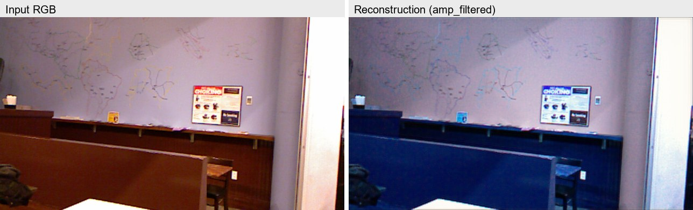
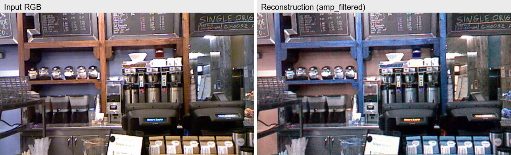
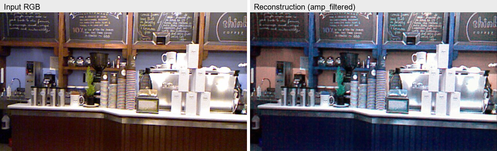

# TensorHolo PyTorch 复现与改进

本项目是对 MIT 官方 **Tensor Holography V2**（*End-to-end Learning of 3D
Phase-only Holograms for Holographic Display*, Light: Science & Applications,
2022）的 PyTorch 复现，并在保持论文管线语义的基础上做了现代化重构与扩展：

- 把原来的 TensorFlow 1.x / `main_v2.py` 单文件训练流程拆成清晰的
  `src/train`、`src/models`、`src/optics`、`src/eval` 模块；
- 主网络同时支持官方 `ComplexHoloNet`（全分辨率、密集残差连接）和新增的
  `ComplexUNet`（多尺度复数 U-Net，可选瓶颈注意力、输出尾块等）；
- stage-2 滤波网络同时支持论文忠实的实值 amp/phase CNN（`RealAmpPhaseDDPMNet`）
  和此前的复数版 `ComplexDDPMNet`；
- 训练、验证、评估、导出仍通过统一的 `main.py` CLI 入口调用，参数命名尽量与
  官方 `main_v2.py` 保持一致。

## 1. 简介

TensorHolo V2 的完整流程可以概括为两步：

1. **Stage-1 主网络**：输入 RGB-D（或 LDI），直接预测中间平面的复数全息场；
2. **Stage-2 DDPM 滤波网络**：把 stage-1 预测的场传播到目标深度，再用一个小型
   CNN 修正场，最后做双相位编码（AA-DPM）与物理孔径滤波，输出可显示的
   phase-only 全息图。

本项目完全用 PyTorch 复数张量实现光学传播、双相位编码、孔径滤波等模块，避免了
官方代码中“NCHW/NHWC 混用”导致的兼容性问题，并保证训练与评估走同一条管线。

## 2. 环境与安装

建议使用 Python 3.10+ 与支持 CUDA 的 PyTorch：

```bash
conda create -n tensor-holo-pytorch python=3.10 -y
conda activate tensor-holo-pytorch
pip install torch --index-url https://download.pytorch.org/whl/cu130
pip install numpy opencv-python tfrecord protobuf tensorboard
```

依赖也列在 [`requirements.txt`](requirements.txt) 中：

```text
torch>=1.12.0
numpy>=1.21.0
opencv-python>=4.5.0
tfrecord>=1.0.0
protobuf>=3.20.0
tensorboard>=2.9.0
```

> 服务器实际使用的 PyTorch 环境名为 `holography`
> （`/root/autodl-tmp/miniconda3/envs/holography`）。

## 3. 数据准备

沿用官方 TensorHolo V2 数据集目录约定，把下载好的数据集放到 `data/` 下，至少需要：

```text
data/
  train_384_v2/       # 训练集图像与 train_04.tfrecord
  test_384_v2/        # 测试集图像与 test_04.tfrecord
  validate_384_v2/    # 验证集图像与 validate_04.tfrecord
  example_input/      # 单张 RGB-D 推理样例
```

默认使用 384×384 分辨率、第一层 LDI（即单张 RGB-D），波长为
450 nm / 520 nm / 638 nm，pixel pitch 为 8 μm。

## 4. 使用方法

所有入口统一通过根目录的 [`main.py`](main.py)。运行模式用布尔开关选择：

| 开关 | 作用 |
|---|---|
| `--train-mode --train-stage stage1` | 训练 stage-1 主网络 |
| `--train-mode --train-stage stage2` | 训练 stage-2 DDPM 滤波网络 |
| `--validate-mode-s1` | 在验证集上验证 stage-1 网络 |
| `--validate-mode-s2` | 在验证集上验证 stage-2 全管线 |
| `--eval-mode` | 对单张 RGB-D 推理并保存全息图 |
| `--export-mode` | 导出 ONNX |

### 4.1 训练 stage-1

用 UNet 主网络训练：

```bash
python main.py --train-mode --train-stage stage1 \
  --model-arch unet --unet-depth 2 --unet-base-filters 24 \
  --dataset-res 384 --batch 2 --learning-rate 1e-4 \
  --num-epochs 4050 --restore
```

用与官方一致的 HoloNet 主网络训练：

```bash
python main.py --train-mode --train-stage stage1 \
  --model-arch holonet --num-layers 30 --num-filters-per-layer 24 \
  --dataset-res 384 --batch 2 --learning-rate 1e-4 \
  --num-epochs 4050 --restore
```

### 4.2 训练 stage-2

从已训练好的 stage-1 ckpt 出发，训练真实 amp/phase DDPM 网络：

```bash
python main.py --train-mode --train-stage stage2 \
  --model-arch unet --unet-depth 2 --unet-base-filters 24 --unet-tail-blocks 16 \
  --dataset-res 384 --activate-ddpm --restore-stage1 \
  --stage1-ckpt model/stage1_unet_d2t16/stage1_latest.pth \
  --stage2-ckpt-dir model/stage2_real_d2t16 \
  --stage2-epochs 8 --joint-epochs 120 --train-depth-shift 12.0 \
  --weight-ssim 3 --ddpm-arch real --ddpm-bn tf \
  --batch 2 --learning-rate 1e-4
```

> 说明：`--weight-ssim` 过大（例如 30）会让模型过度优化 SSIM，导致 PSNR 回退。
> 推荐使用 0–5 的平衡值。可复现的平衡 fine-tune 脚本见
> [`_run_stage2_real_psnrfix.sh`](_run_stage2_real_psnrfix.sh)。

### 4.3 验证

stage-1 验证：

```bash
python main.py --validate-mode-s1 \
  --ckpt-path model/stage1_unet_d2t16/stage1_latest.pth \
  --model-arch unet --unet-depth 2 --unet-base-filters 24 \
  --dataset-res 384
```

stage-2 全管线验证：

```bash
python main.py --validate-mode-s2 \
  --ckpt-path model/stage2_real_d2t16_psnrfix/stage2_joint_latest.pth \
  --activate-ddpm --ddpm-arch real --ddpm-bn tf \
  --model-arch unet --unet-depth 2 --unet-base-filters 24 --unet-tail-blocks 16 \
  --dataset-res 384 --train-depth-shift 12.0
```

如果要复现论文 Table 2 口径的 SSIM/PSNR，建议直接用
[`src/_eval_paper.py`](src/_eval_paper.py)：

```bash
python src/_eval_paper.py \
  --ckpt-path model/stage2_real_d2t16_psnrfix/stage2_joint_latest.pth \
  --model-arch unet --unet-depth 2 --unet-base-filters 24 --unet-tail-blocks 16 \
  --ddpm-arch real --ddpm-bn tf --depth-shift 12.0 \
  --dataset-res 384 --batch 2 --split validate --stage2
```

### 4.4 单张推理

```bash
python main.py --eval-mode \
  --ckpt-path model/stage2_real_d2t16_psnrfix/stage2_joint_latest.pth \
  --activate-ddpm --ddpm-arch real --ddpm-bn tf \
  --model-arch unet --unet-depth 2 --unet-base-filters 24 --unet-tail-blocks 16 \
  --eval-res-h 1080 --eval-res-w 1920 \
  --eval-rgb-path data/example_input/nyu/cafe_1_rgb.png \
  --eval-depth-path data/example_input/nyu/cafe_1_depth.png \
  --eval-output-path output_nyu/cafe_1 --eval-depth-shift 12.0
```

### 4.5 导出 ONNX

```bash
python main.py --export-mode \
  --ckpt-path model/stage2_real_d2t16_psnrfix/stage2_joint_latest.pth \
  --activate-ddpm --ddpm-arch real --ddpm-bn tf \
  --model-arch unet --unet-depth 2 --unet-base-filters 24 --unet-tail-blocks 16 \
  --trt-res-h 1080 --trt-res-w 1920 --output inference_graph_v2.onnx
```

### 4.6 单张推理效果示例

下面使用公开的 NYU Depth V2 `cafe` 场景样图（RGB 与对齐深度）做端到端推理。
深度图按单帧 min-max 归一化到 `[0,1]`；RGB 统一裁剪到 16:9 后由模型缩放至
1920×1080。左列为输入 RGB，右列为 stage-2 输出的 `amp_filtered.png`，即经
双相位编码与物理孔径滤波后的重建结果。







原始输入样图见 [`assets/samples/`](assets/samples/)，重建图见
[`assets/results/`](assets/results/)。原始 RGB-D 数据来自
[NYU Depth Dataset V2](https://cs.nyu.edu/~fergus/datasets/nyu_depth_v2.html)，
下载链接由
[rerun RGB-D 示例集](https://github.com/rerun-io/rerun/tree/main/examples/python/rgbd)
提供。

## 5. 目录结构

```text
main.py                     # 统一 CLI 入口
src/
  data/                     # tfrecord 数据读取与预处理
  models/                   # HoloNet / UNet / DDPM 网络定义
  optics/                   # 传播、DPM、孔径滤波等光学算子
  losses/                   # 复数损失、焦栈损失、DDPM 正则
  train/                    # stage-1 与 stage-2 训练脚本
  eval/                     # 验证、单张评估、ONNX 导出
  utils/                    # 指标、初始化
model/                      # checkpoint（服务器上）
data/                       # 数据集
assets/                     # README 样图、推理结果与对比图
```

## 6. 与原项目（TensorHolo V2）的全面对比

### 6.1 总体对比

| 维度 | 原项目 | 本项目 |
|---|---|---|
| 框架 | TensorFlow 1.15（`main_v2.py` 单文件为主） | PyTorch 2.x，模块化 `src/` 结构 |
| 复数计算 | 手工拆分实部/虚部，NCHW/NHWC 易混 | 原生复数张量，统一 NCHW |
| 主网络 | 仅 HoloNet | HoloNet + 可选 ComplexUNet |
| stage-2 网络 | 实值 amp/phase CNN | 忠实的实值 DDPM + 旧复数 DDPM |
| 光学算子 | TF 图内实现 | PyTorch 复数实现 |
| 入口 | 分散在 `main.py`/`main_v2.py` | 统一 `main.py` |
| 可扩展性 | 改动需手改 dict | 参数化网络与损失 |

### 6.2 各阶段逐项对比

#### 数据与输入

- 两者都读官方 `*_384_v2/*_04.tfrecord`，输入约定一致：RGB-D 为 4 通道，
  先减 0.5 再构造复数字段。
- 本项目在 `src/data/dataset.py` 里用 `tfrecord` 包解析，训练时支持随机深度
  采样与确定性深度采样两种模式。

#### Stage-1 主网络

- 原项目：`ComplexHoloNet`，30 层、24 滤波器，全分辨率密集残差连接。
- 本项目：
  - `--model-arch holonet` 与原项目对齐；
  - `--model-arch unet` 新增多尺度 `ComplexUNet`，支持深度、基础通道数、
    瓶颈自注意力、stem skip、全局输入拼接和 HoloNet 式尾块。

在验证集上的 stage-1（pre-DPM）表现：

| 模型 | SSIM_amp | SSIM_img | PSNR_img |
|---|---:|---:|---:|
| 原 HoloNet | ≈0.94 | ≈0.94 | ≈30 |
| 本 UNet d2t16 | 0.9407 | 0.9412 | 30.50 |

结论：UNet 在 stage-1 已接近甚至略优于论文口径的 SSIM/PSNR。

#### 光学传播与双相位编码

- 原项目用 TF 实现 AS 传播、AA-DPM、`tf_filter_phs_only` 等。
- 本项目用 PyTorch 复数实现对应算子，并显式处理 NCHW 的 `depth_to_space`，
  避免 TF 新版本 CPU 不支持 NCHW 的问题。
- 本项目 DPM 使用“逐样本、逐通道”的振幅归一化，比官方全局 `reduce_max`
  更稳定；实测把 DPM 改回官方全局归一化反而会同时降低 SSIM 与 PSNR。

#### Stage-2 DDPM 网络

- 原项目：8 层、8 滤波器的实值 amp/phase CNN，最后 `tanh` 输出。
- 本项目：`RealAmpPhaseDDPMNet` 与官方逐层对齐，`--ddpm-bn tf` 复现
  `tf.layers.batch_normalization(training=False)` 语义；`--ddpm-arch complex`
  则保留旧复数 DDPM。

#### 损失函数

- 原项目 stage-2 损失：L1 焦栈损失 + L1 焦栈 TV + 相位 std/mean 正则。
- 本项目在此之上增加可选的 `--weight-ssim`（直接优化焦栈 SSIM）和
  `--weight-holo-joint`（主网络保真锚点），默认都为 0，保持原行为。
- 已修正 [`src/losses/ddpm_loss.py`](src/losses/ddpm_loss.py) 中相位 std
  的计算：PyTorch `torch.std` 默认是有偏的样本标准差，已改为
  `unbiased=False`，与 TF `reduce_std` 的总体标准差一致。

#### 验证与评估

- 原项目 `--validate-mode-s2` 只输出 amp SSIM/PSNR。
- 本项目的 [`src/_eval_paper.py`](src/_eval_paper.py) 同时输出 pre-DPM 与
  post-DPM 的 `SSIM_amp / PSNR_amp / SSIM_img / PSNR_img / mean / std`，
  口径与论文 Table 2 一致。

#### 导出

- 原项目用 TensorRT/ONNX，且因 ONNX 不支持复数和 FFT，仅 0 mm 偏移可导出。
- 本项目 `--export-mode` 支持导出 stage-1 或带 DDPM 的主网络；复数传播与
  DPM 仍在运行时执行，因此同样受 ONNX/FFT 限制。

### 6.3 模型质量对比（validate split，100 样本，stage-2 post-DPM）

| 模型 | SSIM_img | PSNR_img | SSIM_amp | PSNR_amp |
|---|---:|---:|---:|---:|
| 官方 TF `ddpm_12` | 0.7860 | 25.72 dB | 0.7877 | 25.81 dB |
| 本 UNet d2t16（`weight_ssim=30`，修复前） | **0.7996** | 25.27 dB | **0.7999** | 25.35 dB |
| 本 UNet d2t16（平衡微调后） | 0.7977 | **25.60 dB** | 0.7971 | **25.69 dB** |

平衡微调后的检查点路径为
`model/stage2_real_d2t16_psnrfix/stage2_joint_latest.pth`，也是本文档第 4 节
推理/验证/导出所使用的检查点。

解释：

- 改进版的 **SSIM 高于官方**，说明结构语义更接近目标；`weight_ssim=30` 时
  SSIM 项过大，把 L1 焦栈损失压住，因此 **PSNR 略低**。
- 用 `--weight-ssim 3` 做很短的 fine-tune 后，PSNR 基本追平官方
  （差距约 0.1 dB），SSIM 仍保持优势。
- 因此“改进版不如原版”主要体现在 PSNR 一项，原因是损失权重失衡，不是网络
  结构或光学实现问题。

## 7. 已知问题与注意事项

1. 服务器上的官方原项目 `tensor-holo/main_v2.py` 曾被改成 NHWC，但 amp/phase
   切片仍按 NCHW 写，直接评估会报 `mul_17` 维度错误。评估官方 ckpt 时应使用
   原始的 NCHW 版本（本项目评估时已用干净的官方源码完成）。
2. 如果要追求更高 PSNR，可把 stage-2 的 `--weight-ssim` 设为 0–5；如果要
   追求更高 SSIM，可适当调大，但会牺牲 PSNR。
